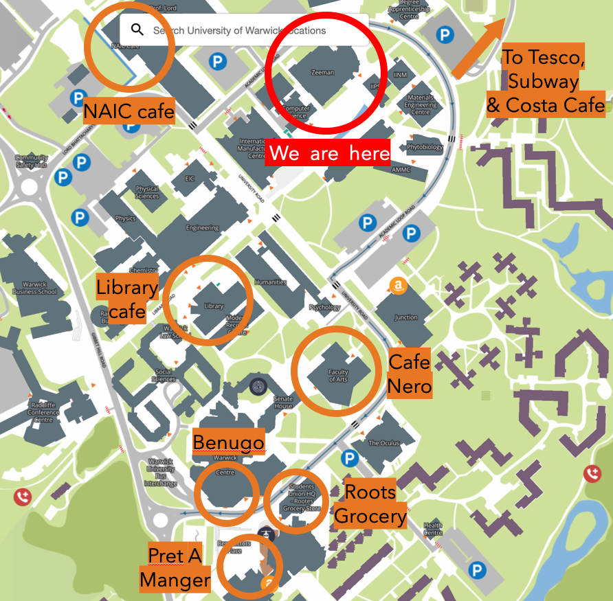

- [Getting Here](#GettingHere)
- [Food](#Food)
- [Accommodation](#Accommodation)
- [Childcare Support](#ChildcareSupport)
- [Financial Support](#FinancialSupport)

The UKI Discs Meeting will be held in the [Zeeman Building](https://campus.warwick.ac.uk//search/623c8859421e6f5928c0c794) at the University of Warwick. Searching "Zeeman Building, Coventry" on Google Maps will get you to the correct location. The university is located on the outskirts of Coventry, about 3 miles to the city centre. The town of Kenilworth is slightly closer (2 miles), but the small county town of Warwick is actually much further away (7 miles).

## Getting Here {#GettingHere}
### *Arriving by train*

The rail option with the most public transport options to get you to the university campus is to arrive at Coventry station (not Warwick station). Coventry station is served by 4 train companies (Avanti West Coast, CrossCountry, West Midlands, and London Northwestern), and is located on the West Coast Main Line (among others), linking London, Birmingham, Manchester, Liverpool, Lancaster, Edinburgh and Glasgow. Coventry station also connects to the Cross Country Route (linking Aberdeen, Newcastle, York, Leeds, Sheffield, Derby, Bristol, Exeter and Penzance) through an easy transfer at Birmingham New Street station.

To get to campus, Coventry train station provides good bus (£2-£4, 15-30 min) and taxi/Uber (£10-15, 10-20 min) options. The buses to campus from Coventry Train Station are the [11](https://nxbus.co.uk/coventry/services-timetables/11-coventry-leamington-spa) and the [12X](https://nxbus.co.uk/coventry/services-timetables/12x-coventry-university-of-warwick), with the latter being the quicker option as it is a more direct route to the Warwick University Interchange. The [87](https://www.stagecoachbus.com/routes/midlands/87/solihull-coventry/xldo087.i) bus also passes around the campus, but does not stop at the main campus' University Interchange. Live bus schedules are linked with the respective route.

Alternatively, Canley station is another option to get to campus. It is a 25-minute walk or a 10 minute cycle to campus. There are no bus options from Canley station. 

### *Arriving by (long-distance) coach*

Coventry is served by both National Express and Megabus. The Coventry drop-off point for both companies is Coventry's main bus and coach hub, Pool Meadow Bus Station, in the city centre. The buses that run to campus from Coventry originate from Pool Meadow Bus Station and, on the way, also stop at Coventry railway station.

### *Arriving by car*

The postcode for the Central Campus is CV4 7AL. On approaches to Coventry, follow the signs to Warwick Arts Centre or the University of Warwick. Car Parks on campus are all controlled by ANPR. Check the [online interactive map](https://campus.warwick.ac.uk/) to find the locations of various car parks. For more information on payment, check this link [here](https://warwick.ac.uk/services/carparks/general_parking/).

### *Arriving by plane*

The closest major airport to the University of Warwick is Birmingham International Airport (BHX). For those using public transportation from Birmingham Airport, take the shuttle train service between the Airport and Birmingham International Railway Station, take a train to Coventry station (Avanti West Coast or West Midlands Trains), and then the bus options above to the University. The total travel time would be around 30-45 minutes and the total cost should be less than £10. Taxis from the airport should be around 20-30 minutes and fares are dependent on the time of day (~£30-£50).
 
If you are flying to London, take the train to London Euston, where you can then take either the Avanti West Coast or West Midlands Trains options to Coventry station. If you are flying to Heathrow/Luton in particular, there is also a direct National Express coach option to Coventry Pool Meadow Bus Station. Upon arriving into Coventry, follow the instructions to the University as above. The journey time from the London airports to the University would be between 1.5-3 hours, depending on the airport.

Alternative airport options include East Midlands, Manchester and Bristol airports. The distance to the University from each of these airports are roughly 3 hours, and we’d recommend following the train/bus combinations from Google Maps.

## Food {#Food}

### *Refreshments*
We will be providing refreshments (tea, coffee, water, biscuits) throughout the meeting. If you have any dietary requirements, please inform us when completing the registration form so that we can accommodate your needs.

### *Lunch*
Lunch will not be provided at this meeting. There are a wide range of food outlets on campus. A list of those open during the meeting, with opening times, is available [here](https://warwick.ac.uk/services/retail/openingtimes/upcoming-times). The Zeeman Building is also close to the Cannon Park Shopping Centre, with a range of fast food lunch options there too. 

Locations of food outlets are highlighted on this map for your convenience 

## Accommodation {#Accommodation} 

There are multiple options for accommodation on or near campus. A comprehensive list can be found [here](https://warwick.ac.uk/services/accommodation/staff/offcampus/relocationservice/shorttermaccommodation/) (in the Short term Accommodation (inc. Hotels and B&Bs header)). For places on campus, select the Warwick Conferences B&B option.

Other options not listed include [Premier Inn](https://www.premierinn.com/gb/en/hotels/england/west-midlands/coventry.html), with multiple branches in both Coventry and Leamington Spa.

## Childcare Support {#ChildcareSupport}

We are working on offering childcare support for those who need it. We understand that there are a wide range of needs, therefore please do indicate on the registration form if you would like childcare and we can get in touch to discuss what you require and the options available.

## Financial Support {#FinancialSupport}
As we have organised this meeting to be free to attend, we do not plan to provide any financial support at this stage. However, if you are facing any exceptional circumstances, do get in touch.
